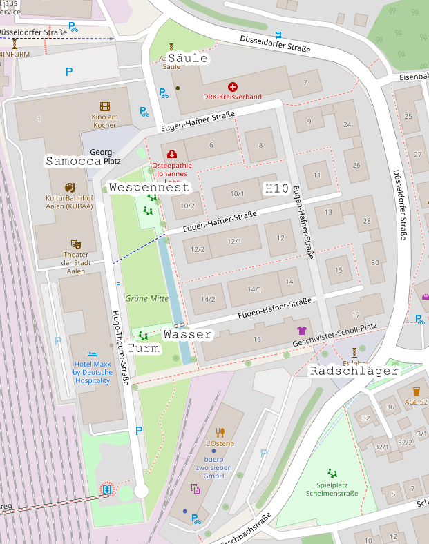

# Einhorn Schnitzeljagd

Eine Schnitzeljagd zum Thema Einhorn zum fünften Geburtstag meiner Tochter.

## Stationen

* **Start:** Zuhause in der Hausnummer 10 ("H10")
* **Station 1:** Popo-Skulptur ("Radschläger")
* **Station 2:** Bach mit Steg ("Wasser")
* **Station 3:** Spielturm mit Rutsche ("Turm")
* **Station 4:** Sandkasten bei der Wespenstelle ("Wespennest")
* **Station 5:** Cafe mit Flügel ("Samocca")
* **Ziel:** Eisenbahnskulptur ("Säule")

### Entfernungen

## Aufgaben
